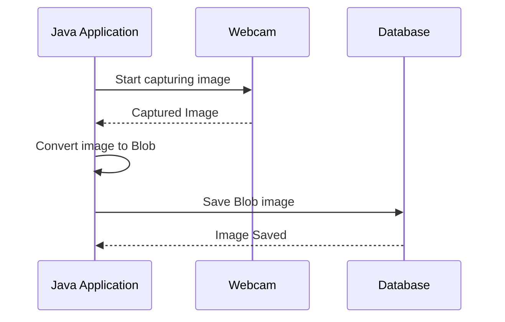

### java-opencv-photo-db

Java desktop application using OpenCV to take photos from your webcam and store on a database as a BLOB file

Requirement
[Java OpenCV](https://opencv-java-tutorials.readthedocs.io/en/latest)




### Usage

```shell
./gradlew run
```
ESQ to exit

ENTER to save

or building jar
```shell
./gradlew shadowJar
java -jar build/libs/opencv-photo-db.jar
```

## Db Configuration
At [src/main/resources/connection.properties](src/main/resources/connection.properties)
```properties
jdbc.driver=org.h2.Driver
jdbc.user=sa
jdbc.pass=
jdbc.url=jdbc:h2:file:~/photo-db
```
